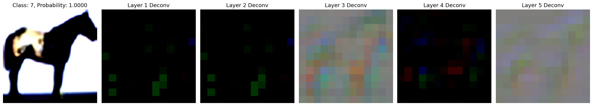
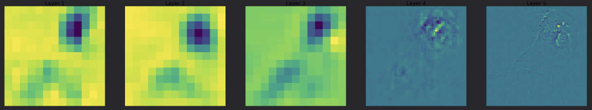

# PaperTorch

Reimplementing ML papers in PyTorch:
- [x] ~~AlexNet [[link to paper](https://papers.nips.cc/paper/4824-imagenet-classification-with-deep-convolutional-neural-networks)]~~
- [x] ~~ZFNet [[link to paper](https://arxiv.org/abs/1311.2901)]~~
- [ ] VGG16 [[link to paper]()]
- [ ] ResNet [[link to paper]()]
- [ ] GoogLeNet [[link to paper]()]
- [ ] Inception [[link to paper]()]
- [ ] Xception [[link to paper]()]
- [ ] MobileNet [[link to paper]()]

More will be added as I go. This current list is all based on NN architecture.

ZFNet Visualization:

After 80 epochs:

You can kinda see it starts by picking up the legs and then by the final layer it has a very pixelated image in the general silhouette of a horse.

A fully converged model:

